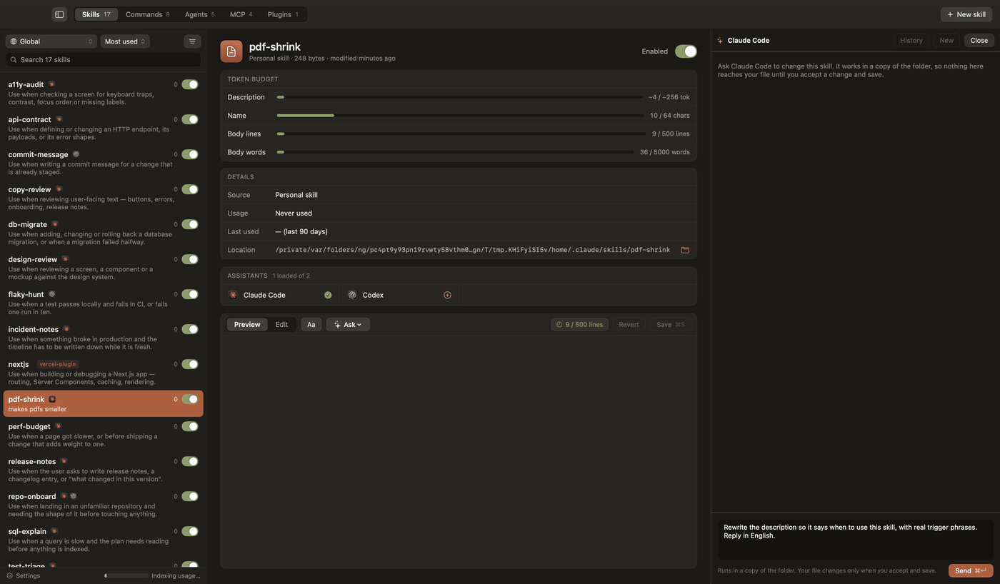

<p align="center">
  
</p>

<h1 align="center">Loadout</h1>

<p align="center">
  <strong>See and manage what your coding assistants load.</strong><br><br>
  Skills, slash commands, subagents, plugins and MCP servers, from every assistant<br>
  on the machine — with how often each one actually fires, and an editor for the ones you own.
</p>

<p align="center">
  
  
  
  <a href="../../releases/latest">
    
  </a>
</p>

## Features

- **A full inventory** — personal and project skills, everything from plugins, slash commands, subagents and MCP servers, across every assistant on the machine
- **Real usage** — how many times each thing fired, when it last did, and in how many projects, read from the assistants' own session logs
- **Honest counts** — a history format that cannot prove an activation is marked unsupported, rather than reporting a zero that looks like disuse
- **Project scope** — answers "what does an assistant see if I open this folder?" — and an Everything list that puts yours and every project's side by side, each row saying where it lives, for when the question is "where did I put that one?"
- **A switch on everything** — turn one skill, command, subagent or MCP server off without deleting it, including a single skill out of a 38-item plugin, and Loadout re-applies that choice when the plugin updates
- **An editor** — create skills, commands and subagents, edit and delete them, with syntax highlighting and live validation against the documented limits
- **A conversation, beside the editor** — ask `claude`, `codex` or `opencode` to change a skill; it proposes, you accept change by change
- **Out of a repository, into your own** — a skill, command or subagent that lives in a project becomes yours everywhere with one click. It is a copy: the project keeps its own, so nobody else loses anything at their next pull
- **Help where the question is** — Settings › Help says in plain words what switching something off does to your files, where Loadout keeps its own, and reports a bug with the version and system already filled in
- **A backup before every write** — if the copy fails, nothing is written. Deleting goes to the Trash, never `rm`
- **One skill, every assistant** — share a skill across assistants as symlinks to a single copy, so one edit reaches all of them. Switching it off asks which assistants it should return to, and a skill never changes hands behind your back

<p align="center">
  
</p>

## Install

1. Download the latest DMG from [**Releases**](../../releases/latest).
2. Open it and drag **Loadout** to **Applications**.

Requires macOS 15 or newer. The build is signed and notarised, so it opens without a warning and
without a trip through System Settings.

Or build it yourself, which needs Xcode:

```bash
git clone https://github.com/migsilva89/loadout.git
cd loadout
./Scripts/build-app.sh
open dist/Loadout.app
```

## Talking to an assistant about a skill

Select a skill and press **Ask**. A conversation opens in a column beside the editor, using the
assistant CLI already installed and the subscription it already has — there is no API key.

The assistant never works in your folder. Loadout copies the skill's folder somewhere disposable
and runs the assistant there, then compares the two and opens each change up inside the document:
the old lines struck through above the new, with **Accept** and **Reject** beside each one.
Accepting edits the draft; the file on disk changes when you save, with the usual backup first.

A skill is a folder, so files beside `SKILL.md` are listed too and written by the same save. The
conversation is remembered per skill and picks up where it left off tomorrow; **History** has the
earlier ones.

In the **New skill** sheet, **Create and ask** makes the skeleton and hands it to an assistant with
what you typed as the brief, so the description and body come back as proposals.

## Sharing a skill across assistants

Each assistant reads its skills from `~/.<name>/skills` — `~/.claude/skills`, `~/.codex/skills`,
and so on. Loadout finds them by itself: any such folder that exists is included, and an assistant
installed tomorrow shows up without a code change.

Clicking an assistant that does not have the skill puts it there. On disk, the folder is promoted
to `~/.agents/skills/<name>` and each assistant gets a symlink to it — one copy, one edit, both
sides always the same. Clicking a lit mark removes only that link, never the one real copy. The
Loadout menu has **Sync all with …** to close the gaps at once.

If two assistants have their own, possibly different, copies of the same skill, the app refuses to
merge them on its own and says why.

## What it touches

| Data | Location | Written by Loadout? |
|---|---|:---:|
| Your skills, commands, subagents and MCP servers | `~/.claude/`, `~/.codex/`, `~/.<assistant>/` | Only when you save, create, delete or share |
| Backups, taken before every write | `~/Library/Application Support/Loadout/backups/` | Yes |
| Usage index, rebuildable | `~/Library/Application Support/Loadout/usage.sqlite` | Yes |
| Working copies for the assistant conversation | `~/Library/Application Support/Loadout/ask-workspaces/` | Yes |
| The assistants' session logs | `~/.claude/projects/`, `~/.codex/sessions/` | Never — read only |

Loadout keeps its own files out of `~/.claude`: that directory belongs to Claude, and an app that
keeps its database in someone else's folder is a surprise waiting for whoever wipes `.claude` to
fix something.

The app itself makes no network calls. The assistant CLI it runs on your behalf talks to its own
provider, with the credentials already on your machine; Loadout never sees them.

The test suite never touches any of this: every test runs against a temporary tree, which is why
`Paths` takes its root by injection.

## Security

See [SECURITY.md](SECURITY.md). The areas that matter here: writes outside the expected
directories, command execution driven by file contents, and any path where a backup fails without
stopping the write.

## Contributing

See [CONTRIBUTING.md](CONTRIBUTING.md) for the scope, how to run the tests, and what a pull
request needs. A feature outside that scope will be declined however well it is written, so open
an issue first. The specification, with the acceptance criteria one by one, is in
[docs/SPEC.md](docs/SPEC.md).

## Status

A personal project, maintained when it suits. It works and is used every day, but it does not come
with a product's promise of support.

Releases are built by `./Scripts/release.sh`, which refuses to run from a dirty tree, an untagged
commit or a branch other than `main`, and runs the tests before signing anything.

## License

[MIT](LICENSE).
